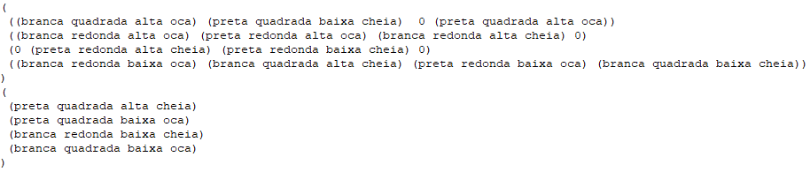
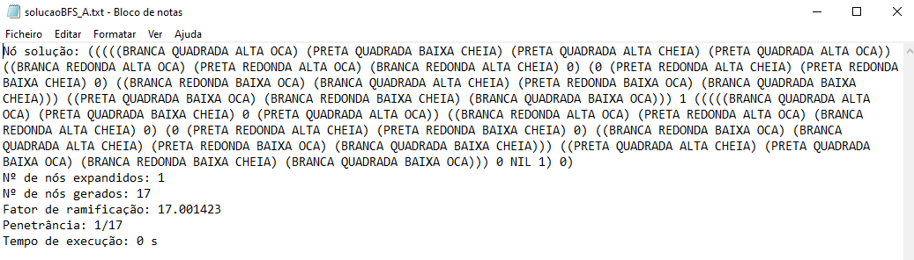
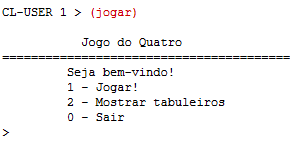
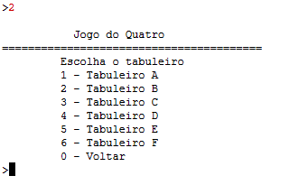
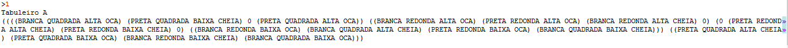
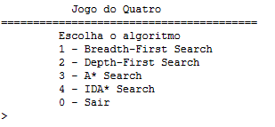
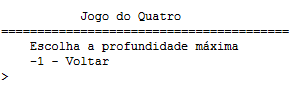
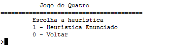
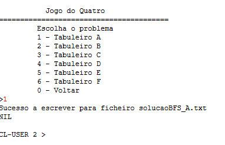
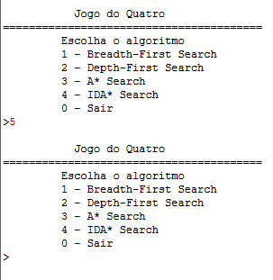

# Manual de Utilizador

## 1. Capa

Inteligência Artificial - Joaquim Filipe  
Problema do Quatro

Alunos  
Ricardo Lopes 180221044  
Rui Silva 180221045

---

## 2. Acrónimos e convenções usadas  

Jogo - Vai se compreender por jogo a junção do tabuleiro com as reservas.  
Nó - Estrutura de dados que guarda a informação da jogada, o estado do jogo, o seu nó-pai e os valores da jogada.  
Lista - Conjunto de dados.

---

## 3. Introdução  

O **manual do utilizador** vai ser uma ajuda para a compreensão do funcionamento do projeto do **jogo do Quatro**, desenvolvido utilizando a linguagem **LISP**. Este programa vai analisar um jogo, composto por um tabuleiro e peças reserva, e devolver a solução ótima do mesmo, através do uso do algoritmo escolhido pelo utilizador.  
Este programa vai permitir ao utilizador, resolver um tabuleiro definido, visualizar o mesmo e analisar os resultados da análise deste.

---

## 4. Instalação e Utilização

Para a configuração do programa vai ser necessário a existência do ficheiro **problemas.dat** dentro deste mesmo diretório para o correto funcionamento do programa.

Para a utilização do programa vai ser necessário o comando (jogar) que vai começar a correr a aplicação e apartir deste, apenas vai ser necessário que o utilizador insira valores númericos para a escolha entre as várias opções ou na decisão dos valores das variáveis dos menus.

---

## 5. Input/Output

O programa apenas permite ao utilizador a escolha de valores númericos para a navegação entre menus. Recebe, também, os jogos definidos no ficheiro **problemas.dat**.

### **Exemplo de um problema**

* **problemas.dat**

O programa vai exportar um ficheiro de escrita, para a solução de um tabuleiro, que vai ter como nome, "solução", com o nome do algoritmo a ser utilizado e o tabuleiro onde foi encontrada a solução. Este ficheiro pode ser encontrado na mesma pasta onde estão todos os outros ficheiros do programa.  
Também vai responder ao utilizador, quando este escolhe um tabuleiro para visualizar, onde o programa vai mostrar ao mesmo o jogo através de escrita.

### **Exemplo de uma solução**

* **soluçãoBFS_A.txt**

Este ficheiro vai estar dividido em 6 pontos:

* Nó solução - Solução encontrada para este tabuleiro, condicionada pelo algoritmo.
* Número de nós expandidos - Número de nós que o algoritmo teve de percorrer para chegar à solução.
* Nº de nós gerados - Número de nós que o algoritmo teve de criar para chegar à solução.
* Fator de ramificação - Número médio de ramos que cada nó gera.
* Penetrância - É o comprimento do caminho até ao objetivo sobre o número total de nós gerados.
* Tempo de execução - Tempo que demorou até ser encontrada a solução.

---

## 6. Exemplo de aplicação

O único comando que o utilizador vai ter de executar, como já referido na Introdução, vai ser o (jogar), após o mesmo, vai ser mostrado um menu e após este, o programa só irá receber valores númericos para a sua utilização.

* **Inicialização do programa**

 Para inicializar o programa, como já referido na Instalação e Utilização, vai ser necessário o comando  

* **Escolher tabuleiro para visualização**

 Quando o utilizador escolhe a opção "Mostrar tabuleiros", vai lhe ser pedido que decida entre números de 1 a 6 para a escolha do tabuleiro pretendido para a visualização. Quando o utilizador escolhe um dos tabuleiros vai ser mostrado o jogo, em resposta ao seu valor correspondente, e após vai continuar a pedir a escolha dos tabuleiros até que o utilizador decida voltar.  

### **Resultado da escolha**

### **Escolher algoritmo**

 Quando o utilizador escolhe a opção "Jogar", vai lhe ser pedido que decida entre números de 0 a 3 para a escolha do algoritmo pretendido.  

Os algoritmos existentes são:  
**BFS** - Algoritmo de procura em largura. Explora todos os nós sucessores de um nó, só depois passa para o próximo. Os nós são guardados em fila, por ordem de chegada.  
**DFS** - Algoritmo de procura em profundidade. Explora através da expansão do primeiro nó filho e aprofunda-se cada vez mais, até que o nó solução seja encontrado, até que ele se depare com um nó que não possui filhos ou mesmo que chegue a um limite na profundidade definido. Se acontecer, a busca volta atrás e começa no próximo nó.  
**A\*** - Algoritmo de procura ordenada. Começa com um nó e, através de uma heurística, percorre os nós com menor custo, chegando assim ao nó solução.  
**IDA\*** - Algoritmo de procura ordenada. Semelhante ao A\* sendo que também começa com um nó e, através de uma heurística, percorre os nós com menor custo, chegando assim ao nó solução, mas este tem um limiar para expandir os sucessores, sendo que este aumenta, quando não existem sucessores com o limiar definido, para o valor do sucessor com o menor custo.

* **Escolher profundidade máxima**

Quando é escolhido o algoritmo Depth-First Search vai ser pedido ao utilizador um valor para a profundidade máxima pretendida.

* **Escolher heuristica**

Quando é escolhido o algoritmo A\* Search ou IDA\* Search vai ser pedido ao utilizador que escolha a heuristica a ser utilizada que neste caso vai só existir uma.

* **Escolher tabuleiro**

Quando já estão definidas todas as configurações para os algoritmos vai ser pedido ao utilizador que escolha entre 6 tabuleiros com jogos diferentes, que em caso de sucesso vai escrever um ficheiro com a solução do mesmo.

Durante todos estes menus vão existir opções para o utilizador voltar nas suas opções, ou mesmo sair do programa. 
Também, para evitar uma opção indesejada, sempre que o utilizador escolha um valor que não seja permitido, vai ser enviado o mesmo menu até que escolha um número válido.

### **Exemplo**

Apenas quando o programa não consegue encontrar uma solução para o tabuleiro utilizado, através do algoritmo pretendido, o programa não cria um novo ficheiro, acabando por crashar devido à falta de memória do próprio IDE.

---
