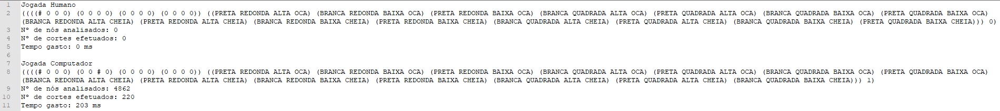

# Inteligência Artificial - Problema do Quatro

## 1. **Manual Técnico - Projeto Nº2**

Inteligência Artifical - Joaquim Filipe  
Quarto  

Realizado por:  
Ricardo Lopes 180221044  
Rui Silva 180221045

---

## 2. **Acrónimos e convenções usadas**

* **base_path** : Variável global que define o caminho para o qual irão ser enviados os ficheiros criados.
* **kebab-case** : Similiar à snake case mas, ao invés de utilizar _underscores_ utiliza hífens para substituir os espaços.
* **lista-nos** : Variável global que define a lista de nós na seguinte estrutura (nós-analisados nós-cortados).
* **menosinfinito** : Variável global que define o menor valor possível.
* **maisinfinito** : Variável global que define o maior valor possível.
* **jogada** : Variável global que define uma lista que contém a melhor jogada atual e o valor da melhor avaliação ambos guardados pelo algoritmo alfabeta.
* **p180221044-180221045**: Nome da package definido pelo docente de laboratório.
  
---

## 3. **Introdução**  

Este projeto tem como objetivo principal a utilização de algoritmos lecionados no âmbito da Teoria de Jogos para a resolução do problema do jogo do Quarto. O utilizador serve-se do programa, e pode escolher dois modos: Computador vs computador(onde apenas tem de definir a profundidade e o tempo limite) ou humano vs computador(onde joga contra o computador tendo primeiro de definir quem será o primeiro a jogar, a profundidade e o tempo limite).

Para cumprir os requisitos abaixo tabelados o programa foi dividido em 4 ficheiros:  

* interact.lisp - Carrega os outros ficheiros de código, escreve e lê de ficheiros e trata da interação com o
utilizador.
* jogo.lisp - Código relacionado com o problema.
* algoritmo.lisp - Contém a implementação do algoritmo de jogo independente do domínio.
* log.dat - Estatísticas de cada jogada.

|Requisito|Descrição|  
|:--------:|:-------:|
|Computador vs Computador|O programa deverá funcionar no modo Computador vs Computador
|Humano vs Computador|O programa deverá funcionar no modo Humano vs Computador
|Interface|O programa deverá de apresentar ao utilizador uma interface de lógica simplista.
|Campeonato|O programa deverá funcionar quando utilizado no campeonato|
|||
---

## 4. **Instalação e Utilização**

1. Descarregar os ficheiros do programa.
2. Instalar o IDE LispWorks na versão 7.1.2.
3. Carregar os 3 ficheiros para o IDE.
4. Digitar o comando **_(p180221044-180221045::jogo)_**.

---

## 5. **Ficheiros e Funções**

        Estrutura de um nó
            <nó> ::= ( <jogo>::=(<tabuleiro> <reserva>) <profundidade>)

### 5.1 **log.dat e Análise**

Neste ficheiro irão constar as estatísticas de cada jogada. Para cada jogada são guardados:  

* Jogador Atual
* Jogada
* Número de nós analisados
* Número de cortes efetuados
* Tempo gasto


Apesado de não termos temporizado o tempo do jogador ao jogar, percebemos obviamente que a resposta do computador é instantânea(demora menos de 1 segundo) o que é muito difícil para o humano sendo que tem de digitar a coluna e a linha antes de jogar.
No entanto, se jogarmos com uma profundidade maior que 2 e seja com que tempo limite for, o computador perde sempre o jogo porque nunca encontra uma solução a tempo. Isto acontece tanto no modo computador vs computador como no do humano vs computador.  
A outra limitação é que, como o projeto está definido em packages qualquer letra que indiquemos nas jogadas humanas, tem de ter o nome da package atrás, ex: **_P180221044-180221043A_**

#### **Estrutura do ficheiro (divisão por estados)**

```
Jogada Computador 1
((((# 0 0 0) (0 0 0 0) (0 0 0 0) (0 0 0 0)) ((PRETA REDONDA ALTA OCA) (BRANCA REDONDA BAIXA OCA) (PRETA REDONDA BAIXA OCA) (BRANCA QUADRADA ALTA OCA) (PRETA QUADRADA ALTA OCA) (BRANCA QUADRADA BAIXA OCA) (PRETA QUADRADA BAIXA OCA) (BRANCA REDONDA ALTA CHEIA) (PRETA REDONDA ALTA CHEIA) (BRANCA REDONDA BAIXA CHEIA) (PRETA REDONDA BAIXA CHEIA) (BRANCA QUADRADA ALTA CHEIA) (PRETA QUADRADA ALTA CHEIA) (BRANCA QUADRADA BAIXA CHEIA) (PRETA QUADRADA BAIXA CHEIA))) 1)
Nº de nós analisados: 14454
Nº de cortes efetuados: 255
Tempo gasto: 0 ms
```

---

### 5.2 **algoritmo.lisp**

Engloba a implementação dos algoritmos da teoria de jogos. Mantivemos uma abordagem recursiva ao longo de todo o projeto, e estas funções não fugiram à regra.  

#### 5.2.1 **Algoritmo Alfabeta**  

O algoritmo escolhido para implementação foi o alfabeta versão fail-hard. O objetivo do algoritmo é encontrar a jogada que maximiza a possibilidade do jogador ganhar.  
Se o nó inicial está no limite de profundidade d, devolvemos o valor da função avaliação deste nó, senão dependendo do jogador(1 ou -1) entramos no cálculo dos sucessores num nível máximo(recorrendo à função **_alfabeta-max_**) ou mínimo(recorrendo à função **_alfabeta-min_**), respetivamente.  

```lisp
(defun alfabeta(no tempo-definido &optional (d 9999) (alfa *menosinfinito*) (beta *maisinfinito*) (jogador 1) (tempo-inicial (get-universal-time)))
  (update-analisados) 
  (cond 
   ((> (- (get-universal-time) tempo-inicial) tempo-definido) nil)
   ((or (= (no-profundidade no) d) (no-solucaop no)) (update-jogada no (funcao-avaliacao (tabuleiro no))))
   (t (cond
       ((= jogador 1) (alfabeta-max (sucessores no) tempo-definido alfa beta d tempo-inicial))   
       (t  (update-jogada no (alfabeta-min (sucessores no) tempo-definido alfa beta d tempo-inicial)))
       )
      )
   )
  ) 
```

A função **_update-jogada_** atualiza a jogada contida na lista global para a melhor jogada encontrada pelo alfabeta e o valor da avaliação que vai sendo guardado recursivamente pelo mesmo.  

```lisp
(defun update-jogada (no valor)
  (cond 
   ((null valor) (reset-jogada-nos))
   ;;<= não resultaria porque contemplaria a possibilidade da jogada ficar com nós cortados.
   ((and (< (second *jogada*) valor) (= (no-profundidade no) 1)) (setf *jogada* (list no valor)))   
   )
  valor
  )
```

A função **_update-cortados_** adiciona um nó aos cortados sempre que acontece um corte na execução do algoritmo alfabeta.
```lisp
(defun update-cortados(valor)
  (setf *lista-nos* (list (car *lista-nos*) (1+ (cadr *lista-nos*))))
  valor
  )
```

A função **_update-analisados_** adiciona um nó aos analisados sempre que o algoritmo alfabeta analisa um novo nó.
```lisp
(defun update-analisados()
 (setf *lista-nos* (list (1+ (car *lista-nos*)) (cadr *lista-nos*)))
)
```

A função **_alfabeta-max_** é executada quando o nó pai é um nó do tipo MAX,ou seja, quando queremos maximizar a nossa jogada. Como queremos maximizar a jogada dentro do tempo limite devemos fazer o máximo entre o valor guardado no alfa e o valor retornado pela função **_alfabeta_**. Este valor irá ser avaliado assim que se atingir a profundidade limite ou um nó solução.  
Após ser retornado o valor desta avaliação, verifica-se se é maior ou igual a beta. Se for maior então dá-se um corte beta no algoritmo alfabeta senão a jogada poderá ou não ser atualizada e o sucessor seguinte será avaliado até ao final dos sucessores.
```lisp
(defun alfabeta-max(sucessores tempo-definido  alfa beta d tempo-inicial)
  (cond 
   ((null sucessores) alfa)
   (t
    (let ((tempo-excedido (alfabeta (car sucessores) tempo-definido d alfa beta -1 tempo-inicial))) (cond ((null tempo-excedido) nil) (t
    (let ((maximo (max alfa tempo-excedido )))
      (cond
       ((>= maximo beta)  (update-cortados beta));;contar os cortes
      ((and (> maximo (second *jogada*)) (= d 1)) (update-jogada (car sucessores) (alfabeta-max (cdr sucessores) tempo-definido maximo beta d tempo-inicial)));;para 1 jogada apenas
       (t (alfabeta-max (cdr sucessores) tempo-definido maximo beta d tempo-inicial))  
       ))
      )
   )
  )))
)
```

A função **_alfabeta-min_** é executada quando o nó pai é um nó do tipo MIN,ou seja, quando queremos minimizar a nossa jogada. Como queremos minimizar a jogada dentro do tempo limite devemos fazer o mínimo entre o valor guardado no beta e o valor retornado pela função **_alfabeta_**. Este valor irá ser avaliado assim que se atingir a profundidade limite ou um nó solução.  
Após ser retornado o valor desta avaliação, verifica-se se é menor ou igual a alfa. Se for menor então dá-se um corte alfa no algoritmo alfabeta senão a jogada poderá ou não ser atualizada e o sucessor seguinte será avaliado até ao final dos sucessores.
```lisp
(defun alfabeta-min(sucessores tempo-definido alfa beta d tempo-inicial)
  (cond 
   ((null sucessores) beta)
   (t
    (let ((tempo-excedido (alfabeta (car sucessores) tempo-definido d alfa beta 1 tempo-inicial))) (cond ((null tempo-excedido) nil) (t
    (let ((minimo (min beta tempo-excedido)))
      (cond
       ((<= minimo alfa) (update-cortados alfa))
       (t  (alfabeta-min (cdr sucessores) tempo-definido alfa minimo d tempo-inicial))  
       )
      )))))
   )
  )
```

---

### 5.3 **projeto.lisp**

Neste ficheiro encontra-se implementada a interação com o utilizador.
O programa é iniciado através da função **_p180221044-180221045::jogo_** que apresenta no menu principal três opções disponíveis, **Jogar Humano vs Computador!** para iniciar o modo humano vs computador, **Jogar Computador vs Computador** para iniciar o modo computador vs computador e **Sair** para terminar o jogo.

#### **Apresentação do menu-inicial.**

```lisp
(defun menu-inicial()
  (format t "~%           Jogo do Quatro")
  (format t "~%========================================")
  (format t "~%         Seja bem-vindo!")
  (format t "~%         1 - Jogar Humano vs Computador!")
  (format t "~%         2 - Jogar Computador vs Computador!")
  (format t "~%         0 - Sair~%>")
  )
```

#### **Implementação da escolha no menu-inicial.**

```lisp
(defun jogo()
  (menu-inicial)
  (let ((opcao (read)))
    (cond 
     ((= opcao 1) (iniciar))
     ((= opcao 2) (iniciar-computadores))
     ((= opcao 0) (format t "Adeus!"))
     (t (jogo))
     )
    )
  )
```

Após a escolha da primeira opção (modo humano vs computador) é invocada esta função **_iniciar_** onde é pedido ao utilizador que escolha quem será o primeiro a jogar, a profundidade e o tempo limite utilizados pelo computador para efetuar a jogada. Se todos os valores forem aceites, o jogo começa senão são pedidos ao utilizador todos os valores novamente.
```lisp
(defun iniciar()
  (format t "Quem é que começa?[H - Humano] [C - Computador]~%>")
  (let ((jogador (read)) (profundidade (progn (format t "~%Qual é o limite de profundidade?[1-5]~%>")(read))) (limite-tempo (progn (format t "~%Qual é o limite de tempo máximo?[1000-5000 ms]~%>") (read))))
    (cond
     ((or (and (not (eq jogador 'H)) (not (eq jogador 'C))) (< profundidade 0) (< limite-tempo 1000) (> limite-tempo 5000)) (iniciar))
     ((eq jogador 'H) (comecar-a-jogar (no-inicial) 'H profundidade limite-tempo))
     (t (comecar-a-jogar (no-inicial) 'C profundidade (/ limite-tempo 1000)))
     )
    )
  )
```

Após a escolha da segunda opção (modo computador vs computador) é invocada esta função **_iniciar-computadores_** onde é pedido ao utilizador que escolha a profundidade e o tempo limite utilizados pelos computadores para efetuar a jogada. Se todos os valores forem aceites, o jogo começa senão são pedidos ao utilizador todos os valores novamente.
```lisp
(defun iniciar-computadores()
  (let ((profundidade (progn (format t "~%Qual é o limite de profundidade?[1-5]~%>")(read))) (limite-tempo (progn (format t "~%Qual é o limite de tempo máximo?[1000-5000 ms]~%>") (read))))
    (cond
     ((or (< profundidade 0) (< limite-tempo 1000) (> limite-tempo 5000)) (iniciar-computadores))
     (t (computador-vs-computador (no-inicial) 1 profundidade (/ limite-tempo 1000)))
     )
    )
  )
```

A função **_computador-vs-computador_** imprime o tabuleiro de cada jogada, limpa a jogada anteriormente guardada e verifica se houve empate ou se algum dos computadores ganhou. O algoritmo invoca a função que retorna o novo tabuleiro, mostra as estatísticas da jogada e escrever as mesma para o ficheiro log.dat recursivamente até algum dos computadores ganhar ou empatarem.
```lisp
(defun computador-vs-computador(no primeiro profundidade-limite tempo-limite)
  (imprime-jogo no)
  (reset-jogada-nos)
  (cond 
   ((tabuleiro-preenchidop (tabuleiro no)) (format t "~%~%Empataram!"))
   ((and (no-solucaop no) (eq primeiro 1)) (format t "~%~%O computador 2 ganhou!"))
   ((and (no-solucaop no) (eq primeiro 2)) (format t "~%~%O computador 1 ganhou!"))
   ((= primeiro 1)  (progn (alfabeta no tempo-limite profundidade-limite) (mostrar-estatisticas 0) (escrever-ficheiro (append '("Computador 1") (list (first *jogada*)) *lista-nos* '(0))) (cond ((computador-perde) (format t "~%~%O computador 2 ganhou!")) (t (computador-vs-computador (cria-no (no-jogo (first *jogada*))) 2 profundidade-limite tempo-limite)))))
   ((= primeiro 2) (progn (alfabeta no tempo-limite profundidade-limite) (mostrar-estatisticas 0) (escrever-ficheiro (append '("Computador 2") (list (first *jogada*)) *lista-nos* '(0))) (cond ((computador-perde) (format t "~%~%O computador 1 ganhou!")) (t (computador-vs-computador (cria-no (no-jogo (first *jogada*))) 1 profundidade-limite tempo-limite)))))
   )
)
```

A função **_comecar-a-jogar_** imprime o tabuleiro da jogada anterior para o utilizador ter uma noção do que foi jogada pelo computador, limpa a jogada anteriormente guardada e verifica se houve empate ou se algum dos jogadores ganhou. Independentemente do jogador atual(computador ou humano), o algoritmo invoca a função que retorna o novo tabuleiro, mostra as estatísticas da jogada e escrever as mesma para o ficheiro log.dat.
```lisp
(defun comecar-a-jogar(no primeiro profundidade-limite tempo-limite)
  (imprime-jogo no)
  (reset-jogada-nos)
  (cond 
   ((tabuleiro-preenchidop (tabuleiro no)) (format t "~%~%Empataram!"))
   ((and (no-solucaop no) (eq primeiro 'H)) (format t "~%~%O computador ganhou!"))
   ((and (no-solucaop no) (eq primeiro 'C)) (format t "~%~%Ganhaste!"))
   ((eq primeiro 'H)  (let ((novo-no (jogada-humana no))) (progn (escrever-ficheiro (list "Humano" novo-no 0 0 0)) (comecar-a-jogar novo-no 'C profundidade-limite tempo-limite)))) 
   ((eq primeiro 'C) (progn (alfabeta no tempo-limite profundidade-limite) (mostrar-estatisticas 0) (escrever-ficheiro (append '("Computador") (list (first *jogada*)) *lista-nos* '(0))) (cond ((computador-perde) (format t "~%~%Ganhaste!")) (t (comecar-a-jogar (cria-no (no-jogo (first *jogada*))) 'H profundidade-limite tempo-limite))))
   )
  )
)
```

A função **_mostrar-estatísticas_** envia para o ecrã as estatísticas de cada jogada após ser efetuada.
```lisp
(defun mostrar-estatisticas(tempo)
 (format t "~%Nº de nós analisados: ~A~%Nº de cortes efetuados: ~A~%Tempo gasto: ~A ms~%~%" (first *lista-nos*) (second *lista-nos*) tempo)
)
```

A função **_reset-jogada-nos_** limpa a jogada anterior para que, o computador consiga atualizar a nova melhor jogada que é guardada durante a execução do algoritmo alfabeta.
```lisp
(defun reset-jogada-nos()
  (setf *lista-nos* (list 0 0))
  (setf *jogada* (list nil *menosinfinito*))
)
```

A função **_computador-perde_** verifica se o computador não conseguiu encontrar a jogada no tempo definido, porque quando o mesmo não consegue nada é guardado na jogada.
```lisp
(defun computador-perde()
  (cond ((null (first *jogada*)) t)
        (t nil)
        )
  )
```

A função **_jogada-humano_** começa por pedir ao utilizador a coluna, a linha e a peça das reservas que deseja jogar. Se algum dos valores não estiver contido no intervalo dado ao utilizador, então são todos pedidos novamente ao utilizador caso contrário devolve o tabuleiro com a peça na posição dada.
```lisp
(defun jogada-humana (no)
  (format t "~%=====================~%Humano~%")
  (let ((coluna (progn (format t"Introduz a coluna [A-D]~%>")(traduzir-coluna (read)))) (linha (progn (format t "Introduz a linha [1-4]~%>")(read))) (peca (progn (format t "Introduz a posição da peça[1-~A]~%>" (length (reserva no)))(read)))) 
    (cond 
     ((< (1- peca) 0) (progn (format t "Posição da reserva inválida.")  (jogada-humana no)))
     ((null (nth (1- peca) (reserva no))) (progn (format t "Peça não existe nas reservas.")  (jogada-humana no)))
     ((null (substituir (1- linha) coluna (nth (1- peca) (reserva no)) (tabuleiro no))) (progn (format t "Coluna ou linha inválidas")  (jogada-humana no)))
     (t (cria-no (cons (substituir (1- linha) coluna (nth (1- peca) (reserva no)) (tabuleiro no)) (cons (remover-peca (nth (1- peca) (reserva no)) (reserva no)) nil)) 0))
     )
    )
  )
```

A função **_traduzir-coluna_** recebe o input dado pelo utilizador, ou seja, a coluna e traduz para o valor correspondente para que seja válido na utilização das funções.
```lisp
(defun traduzir-coluna(valor)
  (cond 
   ((eq valor 'A) 0)
   ((eq valor 'B) 1)
   ((eq valor 'C) 2)
   ((eq valor 'D) 3)
   (t 4)
   )
  )
```

A função **_imprime-jogo_** mostra no ecrã o tabuleiro e reservas do nó passado nos argumentos.
```lisp
(defun imprime-jogo(no)
  (format t "~%~%=====================~%Tabuleiro~%" )
  (imprimir (tabuleiro no))
  (format t "~%Reservas~%" )
  (imprimir (reserva no))
  )
```

A função **_imprimir_** imprime cada linha da parte(reservas ou tabuleiro) para o ecrã recursivamente.  
```lisp
(defun imprimir(parte)
  (cond
   ((null parte) (format t ""))
   (t (progn (format t "~A~%" (car parte)) (imprimir (cdr parte))))
   )
  )
```

#### **5.3.1 Leitura do ficheiro**

##### **Variável global do caminho base**

```lisp
(defparameter *base_path* "C:/Users/lkrak/Desktop/RicardoLopes_180221044_RuiSilva_180221045_P1/")
```

Esta função **_escreve-ficheiro_** recebe uma lista com as estatísticas de cada jogada e escreve para um ficheiro "log.dat" localizado no caminho base que. Se o ficheiro não existir será criado, senão apenas são adicionadas as estatísticas passadas pela lista.
```lisp
(defun escrever-ficheiro (lista)
  (if (null
       (with-open-file (str (format nil "~Alog.dat" *base_path*)
                            :direction :output
                            :if-exists :append
                            :if-does-not-exist :create)
         (format str "Jogada ~A~%" (first lista))
         (format str "~A~%" (second lista))
         (format str "Nº de nós analisados: ~A~%" (third lista))
         (format str "Nº de cortes efetuados: ~A~%" (fourth lista))
         (format str "Tempo gasto: ~A ms~%~%" (fifth lista))
         )) (format t "~%Sucesso a escrever para ficheiro~%") (format t "Erro a escrever para ficheiro"))
  )
```

---

### 5.4 **puzzle.lisp**

#### **Seletores**

A função **_tabuleiro_** recebe, um nó, e devolve o tabuleiro.
```lisp
(defun tabuleiro (no)
  (caar no)
)
```

A função **_reserva_** recebe, um nó, e devolve a reserva de peças.
```lisp
(defun reserva (no)
  (cadar no)
)
```

A função **_linha_*** recebe, um índice e o tabuleiro, e retorna uma lista que representa essa linha do tabuleiro.
```lisp
(defun linha (indice tabuleiro)
  (cond 
    ((or (< indice 0) (null tabuleiro)) nil)
    ((zerop indice) (car tabuleiro))
    (t (linha (1- indice) (cdr tabuleiro)))
  )
)
```

A função **_coluna_** recebe, um índice e o tabuleiro, e retorna uma lista que representa essa coluna do tabuleiro.
```lisp
(defun coluna (indice tabuleiro)
  (cond 
    ((or (< indice 0) (null tabuleiro)) nil)
    (t (maplist #'(lambda (linhaTabuleiro &aux (cabeca (linha indice (car linhaTabuleiro)))) cabeca) tabuleiro))
  )
)
```

A função **_celula_** recebe, dois índices (linha e coluna) e o tabuleiro, e retorna o valor presente nessa célula do tabuleiro.
```lisp
(defun celula (linhaTabuleiro colunaTabuleiro tabuleiro)
  (linha linhaTabuleiro (coluna colunaTabuleiro tabuleiro))
)
```

A função **_diagonal-1_**, recebe, um tabuleiro, e retorna uma lista que representa uma diagonal desse tabuleiro. Considera-se que seja a diagonal a começar pela célula na 1ª linha e 1ª coluna. Vai conter uma função lambda que vai recebendo uma lista das linhas, através do maplist, criando uma variável tamanho que vai fazer a subtração desta lista pelo tamanho original do tabuleiro, conseguindo assim ir buscando as celulas incrementalmente, à medida que o maplist é percorrido.
```lisp
(defun diagonal-1 (tabuleiro)
  (maplist #'(lambda (tabuleiroParte &aux (tamanho (- (length tabuleiro) (length tabuleiroParte)))) (celula tamanho tamanho tabuleiro)) tabuleiro)
)
```

A função **_diagonal-2_** recebe um tabuleiro e retorna uma lista que representa uma diagonal desse tabuleiro. Considera-se que seja a diagonal a começar pela célula na última linha e 1ª coluna. Vai conter uma função lambda que irá receber uma lista de linhas, consoante o que o maplist lhe envia, nessa função vai ser calculado a diferença entre esta lista e o tamanho original do tabuleiro, conseguindo assim 2 variáveis opostas, uma que vai incrementando (tamanho) e outra que vai decrementando (tabuleiroParte), sendo assim possível ir buscar a diagonal, desde a última coluna e primeira linha até à primeira linha e última coluna, à medida que o maplist é percorrido.
```lisp
(defun diagonal-2 (tabuleiro)
  (maplist #'(lambda (tabuleiroParte &aux (tamanho (- (length tabuleiro) (length tabuleiroParte)))) (celula (1- (length tabuleiroParte)) tamanho tabuleiro)) tabuleiro)
)
```

A função **_no-jogo_** recebe um nó e retorna o jogo (tabuleiro e as reservas).
```lisp
(defun no-jogo (no)
  (car no)
)
```

A função **_no-profundidade_** recebe um nó e retorna a profundidade do nó.
```lisp
(defun no-profundidade (no)
  (cadr no)
)
```

#### **Construtor**

A função **_cria-no_** recebe um jogo (tabuleiro e reservas) e devolve um nó que é uma lista do jogo, da profundidade e do pai do nó inicial.
```lisp
(defun cria-no (jogo &optional (g 0))
  (list jogo g)
)
```

#### **5.4.1 Função avaliação**
  
A função **_funcao-avaliacao_** soma todas as pontuações dadas às listas diferentes que estão contidas num tabuleiro, isto é, um tabuleiro é representado por 4 linhas, 4 colunas e 2 diagonais, então esta função faz a soma da lista de pontuações dadas a cada uma destas listas do tabuleiro passado nos argumentos. O mapcar percorre as linhas, aplicando a cada uma a função **_pontuar-lista_**, o maplist percorre as colunas fazendo exatamente o mesmo e a última lista que é concatenada com as outras é constituída pelo valor das diagonais.
```lisp
(defun funcao-avaliacao(tabuleiro)
  (apply '+ (append (mapcar #'(lambda (linha) (pontuar-lista (propriedade-comum linha))) tabuleiro)

                    (maplist #'(lambda (tabuleiroParte &aux (tamanho (- (length tabuleiro) (length tabuleiroParte))))  (pontuar-lista (propriedade-comum (coluna tamanho tabuleiro)))) tabuleiro)
                   
                    (list (pontuar-lista (propriedade-comum (diagonal-1 tabuleiro)))

                          (pontuar-lista (propriedade-comum (diagonal-2 tabuleiro))))
                    )
         )
  )
```

A função **_pontuar-lista_** atribuir valores ao elemento passado nos argumentos. Este elemento representa o número máximo de propriedades comuns numa lista(linha, coluna ou diagonal).
```lisp
(defun pontuar-lista(elemento)
  (cond ((= elemento 4) 100) ((= elemento 3) -50) ((= elemento 2) 10) ((= elemento 1) 1) (t 0))
  )
```

A função **_propriedade-comum_** retorna o número máximo de propriedades comuns numa lista(linha, coluna ou diagonal). Compara cada elemento da lista redutora alisada a todos os elementos da lista alisada. Estas duas listas têm como base a lista inicial.
```lisp
(defun propriedade-comum (lista &optional (x 0) (redutora (alisa lista)) (alisada (alisa lista)))
  (cond 
   ((null redutora) x)
   (t (propriedade-comum lista (max x (propriedadep (car redutora) alisada)) (cdr redutora)))
   )
  )
```

A função **_encontrar-peca_** encontra o índice da coluna ou linha (funções de pesquisa) onde se encontra a peça passada nos argumentos dentro do tabuleiro se a mesma existir.
```lisp
(defun encontrar-peca (tabuleiro peca f-pesquisa &optional (indice (1- (length tabuleiro))))
  (cond
   ((< indice 0) nil)
   ((peca-existep peca (funcall f-pesquisa indice tabuleiro)) indice)
   (t (encontrar-peca tabuleiro peca f-pesquisa (1- indice)))
   )
)
```

A função **_peca-existep_** verifica se uma peça existe num tabuleiro recursivamente comparando cada peca do tabuleiro à peça passada por argumentos.
```lisp
(defun peca-existep (peca lista)
  (cond
       ((null lista) nil)
       ((equal peca (car lista)) t)
       (t (peca-existep peca (cdr lista)))
       )
)
```

---

#### **5.4.2 Funções auxiliares de verificação da solução e de geração de sucessores**

A função **_casa-vaziap_** recebe dois índices (linha e coluna) e o tabuleiro e devolve T se a casa estiver vazia e NIL caso contrário. O valor de uma casa vazia no Problema do Quatro é o valor 0. Sendo para isso necessário verificar apartir do valor da celúla resultante se a mesma é um átomo, resultando no T, ou não, resultando no NIL.
```lisp
(defun casa-vaziap (linhaTabuleiro colunaTabuleiro tabuleiro)
  (if (or (< linhaTabuleiro 0) (> linhaTabuleiro 3) (> colunaTabuleiro 3) (< colunaTabuleiro 0)) nil (atom (celula linhaTabuleiro colunaTabuleiro tabuleiro)))
  )
```

A função **_remover-peca_** recebe uma peça e uma lista com as peças de reserva e devolve uma nova lista sem essa peça de reserva. Verificando essa mesma peça recursivamente, percorrendo assim toda a lista, igualando a peça à cabeça da lista, caso seja diferente adicionando a uma nova lista essa mesma cabeça recursivamente, e caso seja igual a peça vai ser ignorada, enviando novamente a função.
```lisp
(defun remover-peca (peca tabuleiroReserva)
  (cond ((null tabuleiroReserva) nil)
        ((equal peca (car tabuleiroReserva)) (remover-peca peca (cdr tabuleiroReserva)))
        (t (cons (car tabuleiroReserva) (remover-peca peca (cdr tabuleiroReserva))))
   )
)
```

A função **_substituir-posicao_** recebe um índice, uma peça e uma lista que representará uma linha do tabuleiro e substitui pelo valor pretendido nessa posição. Verificando essa mesma peça recursivamente, percorrendo assim toda a lista, igualando o indíce a zero, caso seja diferente adiciona a uma nova lista essa mesma cabeça recursivamente, e caso seja igual a peça vai ser adicionada juntamente com o resto da lista.
```lisp
(defun substituir-posicao (indice peca linhaTabuleiro)
  (cond ((null linhaTabuleiro) nil)
        ((zerop indice) (cons peca (cdr linhaTabuleiro)))
        (t (cons (car linhaTabuleiro) (substituir-posicao (1- indice) peca (cdr linhaTabuleiro))))
  )
)
```

A função **_substituir_** recebe dois índices (linha e coluna), uma peça e o tabuleiro. A função deverá retornar o tabuleiro com a célula substituída pelo valor pretendido. Vai utilizar a função substituir-posicao definida anteriormente. Percorrendo assim, recursivamente as linhas do tabuleiro, criando uma nova lista que vai adicionando a cabeça da lista do tabuleiro, até que a variável definida, linhaTabuleiro, seja igual a zero, significando que é a linha pretendida pelo utilizador e utilizando agora a função **_substituir-posicao_** para alterar a linha, sendo assim adicionada à lista a linha alterada, juntamente com o resto das linhas do tabuleiro não percorridas.
```lisp
(defun substituir (linhaTabuleiro colunaTabuleiro peca tabuleiro)
  (cond ((null tabuleiro) nil)
        ((null (casa-vaziap linhaTabuleiro colunaTabuleiro tabuleiro)) nil)
        ((zerop linhaTabuleiro) (cons (substituir-posicao colunaTabuleiro peca (linha linhaTabuleiro tabuleiro)) (cdr tabuleiro)))
        (t (cons (car tabuleiro) (substituir (1- linhaTabuleiro) colunaTabuleiro peca (cdr tabuleiro)))))

  )
```

A função **_no-solucaop_** recebe um no e retorna T caso o no contenha uma solução e NIL caso contrário. Neste nó vão ser testadas todas as hipóteses onde podem existir soluções, ou seja as diagonais, as linhas, percorrida com a ajuda de um mapcar que devolve uma lista de T ou NIL, onde se existir pelo menos um T é válida, ou as colunas, percorridas com um maplist de modo a conseguir, incrementalmente, aceder a cada coluna existente, devolvolvendo tambem uma lista de T ou NIL, onde se existir pelo menos um T é válida, se alguma destas conter uma solução a função irá retornar um T e NIL caso contrário.
```lisp
(defun no-solucaop(no)
  (let ((tabuleiro (tabuleiro no)))
    (cond
       ((or (solucaop (diagonal-1 tabuleiro))
            (solucaop (diagonal-2 tabuleiro))
            (eval(cons 'or (mapcar #'solucaop tabuleiro)))
            (eval (cons 'or (maplist #'(lambda (tabuleiroParte &aux (tamanho (- (length tabuleiro) (length tabuleiroParte)))) (solucaop (coluna tamanho tabuleiro))) tabuleiro))))
        t)
       (t nil)
       )
    )
)
```

A função **_solucaop_** recebe uma lista e opcionalmente a lista das propriedades e retorna T caso a lista seja uma solução e NIL caso contrário. Vai ser percorrida recursivamente, até que o tamanho da lista, seja igual ao valor do retorno da função *propriedadep*, sendo testada com todas as propriedades existentes recursivamente. Sendo assim só vai encontrar uma solução quando a quantidade de propriedades iguais na lista seja igual a quatro.
```lisp
(defun solucaop (lista &optional (props (propriedades)))
 (cond ((null props) nil)
       ((= (length lista) (propriedadep (car props) (alisa lista))) t)
       (t (solucaop lista (cdr props)))
       )
)
```

A função **_propriedades_** retorna todas as propriedades existentes.
```lisp
(defun propriedades ()
  '(BRANCA PRETA REDONDA QUADRADA ALTA BAIXA OCA CHEIA)
)
```

A função **_propriedadep_** recebe uma peca e uma propriedade e retorna a quantidade de vezes que a propriedade se repete na lista. Percorre a lista da peça recursivamente e incrementando, sempre que a propriedade definida se repetir na lista.
```lisp
(defun propriedadep(propriedade lista)
  (cond ((null lista) 0)
        ((equal propriedade (car lista)) (1+ (propriedadep propriedade (cdr lista))))
        (t (propriedadep propriedade (cdr lista)))
)
)
```

A função **_alisa_** recebe uma lista com sub-listas e devolve a mesma sem sub-listas. Vai ser percorrida recursivamente, criando assim uma nova lista, sendo apenas adicionada, caso a cabeça da lista seja um átomo, se não acontecer é chamada novamente a função mas com essa mesma cabeça, que neste caso não é um átomo, sendo assim essa cabeça percorrida.
```lisp
(defun alisa(lista)
   (cond    
       ((null lista) nil)    
       ((atom (car lista)) (cons (car lista) (alisa (cdr lista))))    
       (t (append (alisa (car lista)) (alisa (cdr lista))))  
    ) 
)
```

A função **_no-existep_** recebe um nó, uma lista e um algoritmo e devolve T se o nó existe dentro da lista e NIL caso contrário. Vai funcionar recursivamente, percorrendo a lista, e dependendo do algoritmo vai ter condições que diferem, sendo que no *dfs* vai ter de comparar a profundidade do nó recebi com o da cabeça da lista, sendo que se a do nó seja a menor vai devolver T, no *bfs* vai ser comparado os tabuleiros do nó e o da cabeça da lista, sendo que esta vai condição vai ser repetida para os outros algoritmos, e devolve T se forem iguais, e por fim o **_a_*** que vai comparar os custos do nó com o da cabeça da lista e caso o do nó seja menor devolve T. Sendo que se a lista for percorrida e não seja encontrado nenhum nó que entre em nenhuma destas condições é devolvido NIL.
```lisp
(defun no-existep(no lista algoritmo)
  (cond
     ((null lista) nil)
     ((and (equal algoritmo 'dfs) (equal (tabuleiro no) (tabuleiro (car lista))) (< (no-profundidade no) (no-profundidade (car lista))))  t)
```

#### **Operadores e sucessores**

A função **_operador_** substitui a casa do tabuleiro indicada pelas coordenadas linhaTabuleiro e colunaTabuleiro e devolve o tabuleiro com a peça adicional retirada das reservas se a casa estiver vazia e as coordenadas forem válidas.
```lisp
(defun operador (linhaTabuleiro colunaTabuleiro peca no)
    (cond ((or (null peca) (null no) (null (casa-vaziap linhaTabuleiro colunaTabuleiro (tabuleiro no)))) nil)
        (t (cria-no (cons (substituir linhaTabuleiro colunaTabuleiro peca (tabuleiro no)) (cons (remover-peca peca (reserva no)) nil)) (1+ (no-profundidade no)) no))
    )
)
```

A função **_sucessores_** constrói a lista de nós sucessores do nó aplicando a cada célula o operador com os índices correspondentes à célula.
```lisp
(defun sucessores (no &optional (profundidade 9999) (pecas (reserva no)) (linhaTabuleiro 0) (colunaTabuleiro 0))
  (remove nil
          (cond
           ((or (null no) (null pecas) (>= (no-profundidade no) profundidade)) nil)
           ((= linhaTabuleiro 4) (sucessores no profundidade (cdr pecas) 0 0))
           ((= colunaTabuleiro 4) (sucessores no profundidade pecas (1+ linhaTabuleiro) 0))
           (t (cons (operador linhaTabuleiro colunaTabuleiro (car pecas) no) (sucessores no profundidade pecas linhaTabuleiro (1+ colunaTabuleiro))))
           )
          )
)
```

---

#### **Campeonato**

A função **_jogar_** determina a melhor jogada(coordenadas e estado) a realizar de acordo com o estado e tempo recebidos. O estado da jogada é o tabuleiro + reservas da melhor jogada. Retorna as coordenadas da melhor jogada e a mesma.
```lisp
(defun jogar (estado tempo &optional (profundidade 2))
  (reset-jogada-nos)
  (alfabeta (cria-no estado 0) (/ tempo 1000) profundidade)
  (let ((peca-diferente (encontrar-diferente (car estado) (tabuleiro (first *jogada*)))))
    (list (read-from-string (concatenate 'string (traduzir-valor (encontrar-peca (tabuleiro (first *jogada*)) peca-diferente 'coluna)) (write-to-string (1+ (encontrar-peca (tabuleiro (first *jogada*)) peca-diferente 'linha))))) (no-jogo (first *jogada*)))
  )
)
```

A função **_traduzir-valor_** traduz a coluna que é encontrada quando é feita a comparação entre dois estados, o estado da jogada anterior e o estado da jogada que queremos realizar.
```lisp
(defun traduzir-valor (valor)
  (cond 
   ((= valor 0) "A") 
   ((= valor 1) "B")
   ((= valor 2) "C")
   ((= valor 3) "D")
   (t nil)
   )
  )
```

A função **_encontrar-diferente_** verifica se existe alguma linha diferente entre dois tabuleiros. Retorna a peça que consta nessa linha recorrendo à função **_encontrara-diferenteLinhas_** se for diferente, caso contrário retorna null.
```lisp
(defun encontrar-diferente (tabuleiro-antigo tabuleiro-novo)
  (cond 
   ((null tabuleiro-antigo) nil)
   ((not (equal (car tabuleiro-antigo) (car tabuleiro-novo))) (encontrar-diferenteLinhas (car tabuleiro-antigo) (car tabuleiro-novo)))
   (t (encontrar-diferente (cdr tabuleiro-antigo) (cdr tabuleiro-novo)))
   )
  )
```

A função **_encontrar-diferenteLinhas_** verifica se existe alguma peça diferente entre duas linhas. Retorna a peça que consta nessa linha  se for diferente, caso contrário retorna null.
```lisp
(defun encontrar-diferenteLinhas (linha-antiga linha-nova)
  (cond 
   ((null linha-antiga) nil)
   ((not (equal (car linha-antiga) (car linha-nova))) (car linha-nova))
   (t (encontrar-diferenteLinhas (cdr linha-antiga) (cdr linha-nova)))
   )
  )
```

## 6. **Melhorias na aplicação**

* Utilização de memoização e procura quosciente para melhorar o desempenho dos algoritmos.
* Implementação de uma função de avaliação melhor.  

---
