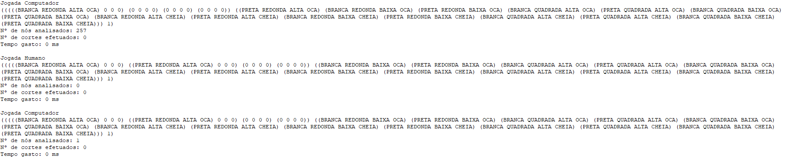
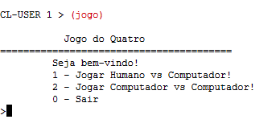
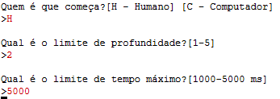
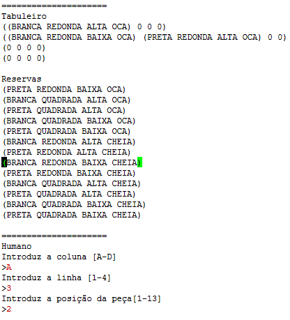
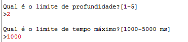
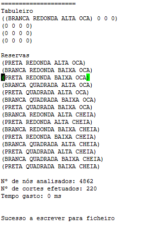
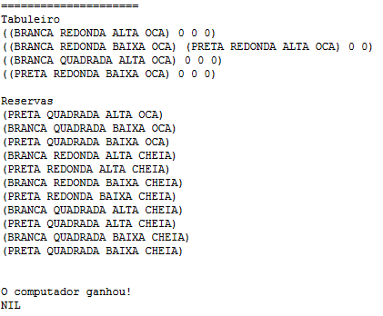
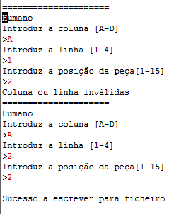
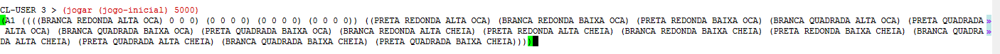

# Manual de Utilizador

## 1. Capa

Inteligência Artificial - Joaquim Filipe  
Problema do Quatro - 2ª Fase

Alunos  
Ricardo Lopes 180221044  
Rui Silva 180221045

---

## 2. Acrónimos e convenções usadas  

Jogo/Estado - Vai se compreender por jogo/estado a junção do tabuleiro com as reservas.  
Nó - Estrutura de dados que guarda a informação da jogada, o estado do jogo, o seu nó-pai e os valores da jogada.  
Lista - Conjunto de dados.

---

## 3. Introdução  

O **manual do utilizador** vai ser uma ajuda para a compreensão do funcionamento do projeto do **jogo do Quatro**, desenvolvido utilizando a linguagem **LISP**.  
O utilizador vai poder escolher neste programa entre um jogo de utilizador contra computador ou computador contra computador. Para a escolha do computador o programa vai analisar um jogo, composto por um tabuleiro e peças reserva, e devolver a escolha da melhor jogada, através do uso do algoritmo alfabeta.

---

## 4. Instalação e Utilização

Para o funcionamento do programa são necessários os ficheiros:

* jogo.lisp
* interact.lisp
* algoritmo.lisp  

Também, para a configuração do programa, irá ser necessário a modificação da variável global **basepath**, do ficheiro interact.lisp, para o programa conseguir imprimir o ficheiro para o local escolhido.

Para a utilização do programa vai ser necessário o comando (jogo) que vai começar a correr a aplicação e apartir deste, vai ser necessário que o utilizador insira valores númericos para a escolha entre as várias opções ou na decisão dos valores das variáveis dos menus. Vai também ser necessário durante o jogo, que o utilizador, escolha a coluna através de um carácter A-D, escolha a linha de 1-4 e escolha a peça que quer jogar de 1 à quantidade de peças reservas restantes.

---

## 5. Input/Output

O programa permite ao utilizador, a escolha de valores númericos para a navegação entre menus. Durante o jogo, recebe tambem os números da linha e da escolha da peça de reserva, tal como a escolha da coluna através de um carácter.

O programa vai exportar um ficheiro de escrita, das estatísticas das escolhas do programa e do utilizador no decorrer do jogo, que vai ter como nome, "log.dat". Este ficheiro pode ser encontrado na mesma pasta onde estão todos os outros ficheiros do programa.  
Também, durante o jogo, o programa vai mostrar no ecrã as mesmas estatísticas que vai guardar no ficheiro.

### **Exemplo de uma parte de um jogo**

* **log.dat**

Este ficheiro vai estar dividido em 6 pontos:

* Nome - Nome de quem fez a jogada (utilizador ou computador)
* Tabuleiro resultante - Melhor jogada encontrada para o tabuleiro recebido, condicionada pelo algoritmo, com mais probabilidades de vitória.
* Número de nós analisados - Número de nós que o algoritmo teve de analisar para chegar à solução.
* Nº de cortes efetuados - Número de cortes que o algoritmo teve de efetuar até chegar à solução.
* Tempo gasto - Tempo que demorou até ser encontrada a solução.

---

## 6. Exemplo de aplicação

O único comando que o utilizador vai ter de executar, como já referido na Introdução, vai ser o jogo, após o mesmo, vai ser mostrado um menu. O programa só irá receber valores númericos para a navegação entre os menus.

* **Inicialização do programa**

 Para inicializar o programa, como já referido na Instalação e Utilização, vai ser necessário o comando jogo onde vai mostrar um menu para que o utilizador escolha entre as diferentes opções do jogo do quatro.

* **Escolher humano contra computador**

 Quando o utilizador escolhe a opção "Jogar Humano vs Computador", vai lhe ser pedido que decida através de um carácter (H ou C) quem vai começar o jogo. Quando o utilizador escolhe quem inicia o jogo, em seguida, é lhe pedido que escolha a profundidade limite e por fim o tempo limite em que o computador pode responder.  

 Posteriormente, é mostrado no ecrã o jogo resultante, da jogada anterior ou o inicial, onde, dependendo da escolha do utilizador de quem começa primeiro, ou pede a jogada do computador, resultante do algoritmo alfabeta, ou pede ao utilizador a coluna (A-D), a linha (1-4) e a escolha da reserva a utilizar (1 ao tamanho das peças restantes) para ser realizada a jogada do utilizador.  

**Exemplo jogada do utilizador**  

### **Escolher computador contra computador**

 Quando o utilizador escolhe a opção "Jogar Computador vs Computador", é lhe pedido a profundidade e em seguida o tempo limite.  
 O jogo vai, em seguida, ser realizado pelos computadores, onde vão escrever para o ecrã e para o ficheiro os resultados que vão realizando.

**Exemplo jogada do computador**  

Dependendo do vencedor vai ser enviada uma mensagem de vitória a quem ganhou, seja ele o computador, 1 ou 2, no caso de jogo entre os mesmos, ou o utilizador, juntamente com o jogo resolvido.  
No caso de o computador não conseguir encontrar uma jogada no tempo limite, escolhido pelo utilizador, o computador perde automaticamente.

**Exemplo de mensagem de vitória**  

O algoritmo existente é:  
**AlfaBeta** - Algoritmo de busca que visa diminuir o número de nós que são avaliados pelo algoritmo minimax.  
Vai explorar os nós semelhantemente ao algoritmo *depth-first*, sendo que explora através da expansão do primeiro nó filho e aprofunda cada vez mais, até que o nó solução seja encontrado, até que ele se depare com um nó que não possui filhos ou mesmo que chegue a um limite na profundidade definido. Se acontecer, a busca volta atrás e
começa no próximo nó. Sendo a diferença, os valores alfa e beta que vai encontrando à medida que percorre os nós folha e os cortes que vai aplicar devido à comparação entre o alfa e ao beta.

Durante todos estes menus vão existir opções para o utilizador voltar nas suas opções, ou mesmo sair do programa.  
Também, para evitar uma opção indesejada, sempre que o utilizador escolha um valor que não seja permitido, vai ser enviado o mesmo menu até que escolha um número válido. Mesmo durante a escolha da jogada do utilizador, mesmo se este inserir um dado inválido vai-lhe ser pedido que insira novamente todos os dados da jogada com uma mensagem que dá ao utilizador uma dica onde pode ter errado.

**Exemplo de erro no input da jogada**  

## 7. Campeonato  

Quanto ao campeonato, todo o código foi posto em pastas, com o nome **"p180221044-180221045"**, e foi criado um comando **jogar** com os parâmetros estado e tempo em que devolve uma lista com as coordenadas da jogada e o novo estado, sendo este calculado através do algoritmo alfabeta estabelecido encontrando assim a melhor jogada.

**Exemplo de jogada para campeonato**  

---
